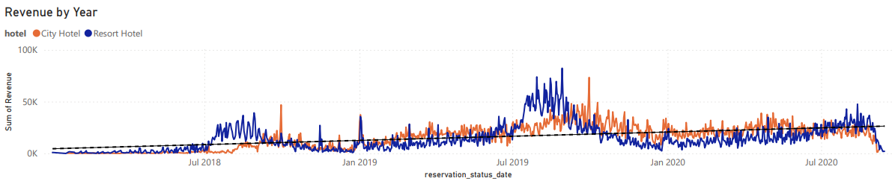
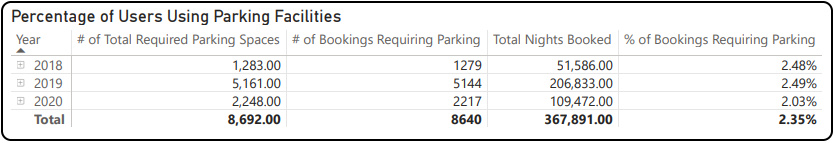
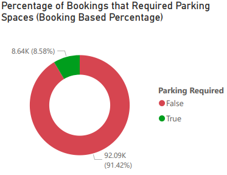
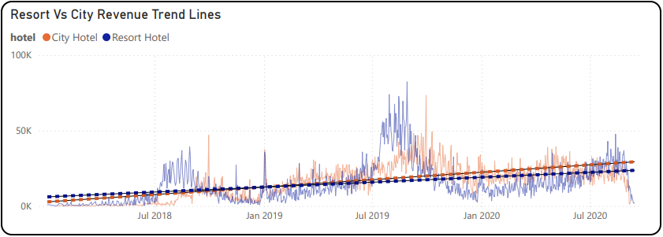
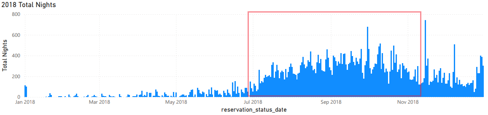
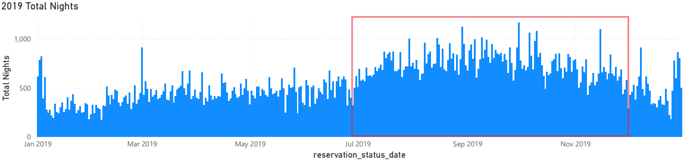
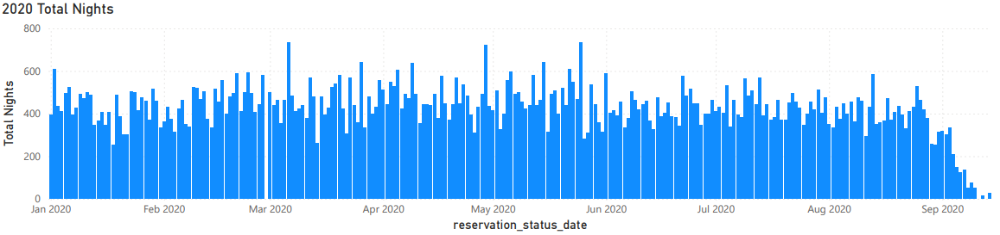

# Hotel Data Analysis - Power BI Project

This project is part of my Data Analysis Portfolio

Project Summary

This interactive Power BI report analyzes hotel booking data to uncover insights related to:

- Booking trends
- Revenue by market segment
- Seasonal performance
- Lead time distribution

## Project Objectives & Insights

### Is our hotel revenue growing by year?
   - Yes, the total revenue has increased year over year.
   - The line chart visualizes annual revenue growth. We can see that over time, the daily revenue rate of our hotels is increasing. This can be easily understood by the trend lines showcased in the Revenue by Year line graph.

   

### Should we increase our parking lot size?
   - Not necessarily. In regards to parking demand, We can see that for each year, the percentage of bookings that required parking was only between 2%-2.5%. It seems that the percentage of users using the parking facilities has remained stagnant over the years, so increasing the parking lot size is not recommended.

  

   - In the same vein, regardless of how many nights a guest may stay, we can see that for each booking there is a 8.58% chance that the booking will require at least one parking spot for the whole booking.

  

  
### What other trends can we see in the data?
#### 1. Resort Hotels vs City Hotels
   - By checking the lead time for each booking, we can find out that bookings for resort hotels may have longer average lead times than city hotels.

   - We can also notice that there seems to be a difference in amount of growth when it comes to City Hotels vs Resort Hotels, with City Hotels having a much more notable growth. As seen on the graph below showcasing revenue trend lines.

  

#### 2. Monthly Booking Frequency
   - By using the total nights spent at our hotels along with when that reservation was booked for, we can see that usually there are much more bookings from July to November (highlighted in red). It should also be noted that the data for 2020 is still incomplete.

   
   
   

## Technologies Used

- Power BI Desktop (report building and data modeling)
- DAX (Data Analysis Expressions for custom metrics)
- Power Query (data transformation and ETL)

## If viewed in PowerBI, the report dashboard includes ways to filter for hotels by their type (City/Resort). Filtering by which Country the hotel is in or by specific dates is also available.